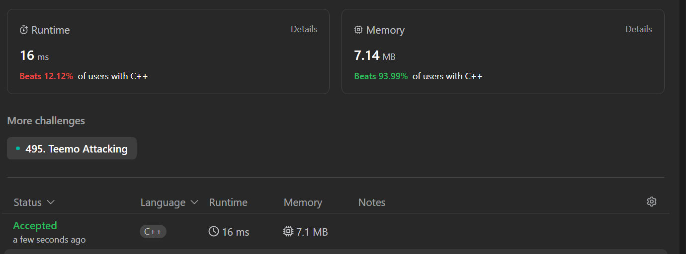

# Bryant’s Leetcode Notes

# ****Remove Duplicates from Sorted Array (Easy)****

## Problem:

Given an integer array `nums` sorted in **non-decreasing order**, remove the duplicates **[in-place](https://en.wikipedia.org/wiki/In-place_algorithm)** such that each unique element appears only **once**. The **relative order** of the elements should be kept the **same**. Then return *the number of unique elements in* `nums`.

Consider the number of unique elements of `nums` to be `k`, to get accepted, you need to do the following things:

- Change the array `nums` such that the first `k` elements of `nums` contain the unique elements in the order they were present in `nums` initially. The remaining elements of `nums` are not important as well as the size of `nums`.
- Return `k`.

## Found Solution:

```cpp
class Solution {
public:
    int removeDuplicates(vector<int>& nums) {
        if (nums.size() == 0) {
            return 0;
        }
        if (nums.size() == 1) {
            return 1;
        }
        vector<int> numsRep;
        //swap(nums, 0, 2); test statement for swap
        numsRep.push_back(nums[0]);
        int max = nums[0];
        for (int i = 1; i < nums.size(); i++) { //we're given the first num by default
            if (nums[i] > max) {
                max = nums[i];
                numsRep.push_back(nums[i]);
            }
        }
        nums = numsRep;
        return numsRep.size();
    }
    /*
    void swap (vector<int>& nums, int i, int j) {
        int swp;
        swp = nums[i];
        nums[i] = nums[j];
        nums[j] = swp;
    }*/
};
```

## Runtime and Memory Usage:


## Notes:

### Problem Assumptions:

As long as there is something in the vector, I will always be able to have an “anchor” of the highest value.

Because the problem array is sorted, I can get away with finding the max value and then skipping all duplicates in between 

### Solution Code:

Wanted to do a solution with swapping the actual vector elements itself, but the simulated vector came faster and easier to me, and given that I was timing myself, it seemed like the most optimal way to push an efficient solution out. O(N) time seemed good, I feel like I could’ve done with using a dynamic array for space efficiency but being able to simply set the parameter to my vector replica seemed very nice

### Runtime and Memory:

The Memory usage was around the same, but runtime would vary between apparently 0ms - 21 ms, with 3 runs at 4ms, 1 run at 0ms, 1 run at 21ms, 1 run at 18ms.


## Time spent to solve:
15 min

# Best Time to Buy and Sell Stock II

## Problem:

You are given an integer array `prices` where `prices[i]` is the price of a given stock on the `ith` day.

On each day, you may decide to buy and/or sell the stock. You can only hold **at most one** share of the stock at any time. However, you can buy it then immediately sell it on the **same day**.

Find and return *the **maximum** profit you can achieve*.

## Found Solution:

```cpp
class Solution {
public:
    int maxProfit(vector<int>& prices) {
        if (prices.size() == 0 || prices.size() == 1) {
            return 0;
        }
        int high = prices[0], total = 0;
        for (int i = 1; i < prices.size(); i++) {
            if (prices[i] > high) {
                total += (prices[i] - high);
                high = prices[i];
                //cout << "ADDED AT: " << i << " ";
                //cout << "total " << total << " high " << high << endl;
            }
            else if (prices[i] < high) {
                //cout << "CHANGED BUY SET FROM: " << high << " TO: " << prices[i] << endl;
                high = prices[i];
            }
        }
        return total;
    }
};
```

## Runtime and Memory Usage:


## Notes:

### Problem Assumptions:

I have the knowledge of the future, not constrained to days

### Solution Code:

Felt like this was a decent solution, basically just iterated through the list looking for lows and highs, then replacing any lower prices with highs, selling whenever there was any profit to be had, using the greedy algorithm.

### Runtime and Memory:

Would’ve liked to known how I could’ve made memory usage more efficient, but I feel pretty satisfied with the runtime.

## Time Spent to Solve:

12 min
# Longest Substring Without Repeating Characters (Medium)

## Problem:

Given a string s, find the length of the longest substring without repeating characters.

## Found Solution:

```cpp
class Solution {
public:
    int lengthOfLongestSubstring(string s) {
        int maxlen = 0, currlen = 0, size = s.size();
        if (size == 1) {
            return 1;
        }
        else if (size == 0) {
            return 0;
        }
        string sub = "";
        for (int i = 0; i < size; i++) {
            for (int j = i; j < size; j++) {
                if (find(sub, s[j])) {
                    
                    break;
                    //cout << "hit replica" << endl;
                }
                else {
                    sub += s[j];
                    //cout << "sub: " << sub << endl;
                    currlen++;
                }
            }
            if (currlen > maxlen) {
                maxlen = currlen;
            }
            currlen = 0;
            sub = "";
        }
        return maxlen;
    }

    bool find(string str, char f) {
        int i = 0;
        while (str[i] != '\0') {
            if (f == str[i]) {
                return true;
            }
            i++;
        }
        return false;
    }
};
```

## Runtime and Memory Usage


## Notes:

### Problem Assumptions:

None not given, pretty straight forwaer

### Solution Code:

Not my proudest implementation of code, there’s probably a better algorithm I could’ve used, but O(n^3) is definitely not ideal and I need to improve the efficiency. This is a sign that I need to start studying up on my algorithms. Looking at the solution codes, I see a lot of implementations of sets, which was considered but I again struggled to figure out best implementation. Note of posterity, I was not aware of the count function.

### Runtime and Memory:

I know of a few ways to bring down my memory usage, which I’ll try on my second run through, but I need to be able to identify better algorithms to solve this issue. I feel like my issue is not misunderstanding of the algorithm but struggling to apply the algorithms in a relevant way.

## Time Spent to Solve:

26 min

# Dota2 Senate (Medium)

## Problem:

In the world of Dota2, there are two parties: the Radiant and the Dire.

The Dota2 senate consists of senators coming from two parties. Now the Senate wants to decide on a change in the Dota2 game. The voting for this change is a round-based procedure. In each round, each senator can exercise **one** of the two rights:

- **Ban one senator's right:** A senator can make another senator lose all his rights in this and all the following rounds.
- **Announce the victory:** If this senator found the senators who still have rights to vote are all from the same party, he can announce the victory and decide on the change in the game.

Given a string `senate` representing each senator's party belonging. The character `'R'` and `'D'` represent the Radiant party and the Dire party. Then if there are `n` senators, the size of the given string will be `n`.

The round-based procedure starts from the first senator to the last senator in the given order. This procedure will last until the end of voting. All the senators who have lost their rights will be skipped during the procedure.

Suppose every senator is smart enough and will play the best strategy for his own party. Predict which party will finally announce the victory and change the Dota2 game. The output should be `"Radiant"` or `"Dire"`.

## Found Solution:

```
class Solution {
public:
    string predictPartyVictory(string senate) {
        string decision = "", test = senate;
        int s = senate.size(), i = 0;
        map<int, bool> eligible;
        if (senate.find('D') == -1) {
            return "Radiant";
        }
        else if (senate.find('R') == -1) {
            return "Dire";
        }
        while (senate.find('D') != -1 && senate.find('R') != -1) {
            if (senate[i] == 'R') {
                int x = senate.find_first_of('D', i);
                if (x == -1) {
                    x = senate.find('D');
                }
                //cout << "found " << x << endl; 
                senate[x] = 'X';
                //cout << senate << endl;
            }       
            else if (senate[i] == 'D') {
                int x = senate.find_first_of('R', i);
                if (x == -1) {
                    x = senate.find('R');
                }
                //cout << "found " << x << endl;
                senate[x] = 'X';
                //cout << senate << " " << i << endl;

            }
            if (i >= s) {
                i = 0;
            }
            else {
                i++;
            }
        }
        if (senate.find('D') != -1) {
            //cout << senate << endl;
            //cout << senate.find('D') << endl;
            return "Dire";
        }
        else {
            cout << senate << endl;
            return "Radiant";
        }
        //cout << senate << endl;
        //return decision;
    }
};
```

## Runtime and Memory Usage



## Notes:

### Problem Assumptions:

Game theory, every senator acts as best possible to win the “game”, so essentially attempting to stop the next available opposing senator

### Solution Code:

Went for the more naive attempt, but I felt that it wasn’t a BAD solution. It did take me a bit longer though, I would’ve finished at around the 30 min mark if I hadn’t doubted my original algorithm when I hit a heap overflow issue and started to play around with it.

### Runtime and Memory:

I understand the runtime issue, but I did design my code to be as memory efficient as possible, not making any copies of the string, just iterating through the original one.

## Time Spent to Solve:

48 min